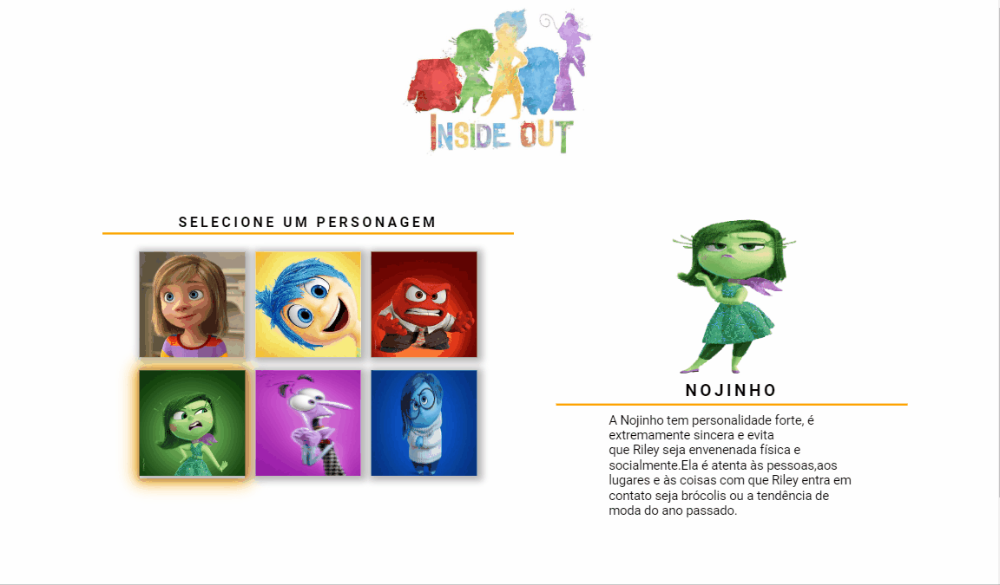

# Divertidamente

## Do que se trata esse projeto?
Este projeto trata-se de uma página interativa sobre o filme Divertidamente. É possível conhecer os personagens
e um pequeno resumo sobre eles.

## Quais interações são realizadas?
- Ao passar o mouse sobre o personagem, a imagem ao lado troca para o personagem correspondente,
mostrando seu nome e sua descrição.
- O fundo da tela é animado, com bolas subindo continuamente na cor do personagem selecionado, fazendo uma alusão ao filme, já que as esferas são as emoções da personagem Riley.
  
## Habilidades desenvolvidas:
- Uso de flexbox para ajustes dos elementos na tela.
- Uso de Keyframes para animação do background.
- Uso e manipulação dos elementos no JavaScript.
- Uso de funções, eventos,condicionais,atributos como data-name e data-description.
- Uso de mediaqueries para responsividade.

## Linguagens Utilizadas:
- HTML 

- CSS  

- JAVASCRIPT  
          

## Veja como ficou:

### Desktop:
 
 
### Tablet:

### Mobile:
 

Para ver o projeto pronto, [clique aqui!](https://jessica-os.github.io/Divertidamente/)
